# KICKSTARTER VS COVID

## Introduction

KickStarter has been in operation since 2009 and the market of crowd-funding was revolutionized by it. Today, it can be difficult to determine the most effective methods to increase the likelihood of success. KickStarter does provide advice to campaigners, however, it is ultimately a contextual issue as no two campaigns were created equal. The merit of ideas, products and innovations may largely contribute to success. However, this merit is too semantic and contextual to be measured or analyzed effectively. Instead, this project aims to affect what change is possible through the ideal selection of parameters that may heighten the odds of success.

Campaigners are the key stakeholders as the aim of this project is to maximize their odds of a successful campaign during COVID-19; this was achieved by highlighting key decisions that a campaigner can make. Success in this instance is defined as where a project meets its allotted goal, irrespective of whether the campaign is cancelled for other reasons. The reason for this distinction is to clarify that this project aims to maximize projects meeting their goal, not whether they decide to continue with the project irrespective of meeting their goal or not.

## Data Gathering

Kaggle was one of the candidates in the pursuit of Kickstarter data. However, the data available in Kaggle was only for the years 2018 and prior. The data requirements for this project include a considerable amount of data before and after the COVID-19 outbreak. In narrowing the scope of this project, the refined data requirement is concentrated on data just before COVID and after the outbreak. Kickstarter data for the year 2020 is also important in analyzing the impact of COVID on predictability. Therefore, the KickStarter data available in Kaggle will not serve the purpose.

[WebRobots](https://webrobots.io/kickstarter-datasets/) provided the solution for our data requirement (Dataset: 2020-08-13 - [CSV]). WebRobots curated this data by web scraping KickStarter through each category. The data relates to all the Kickstarter projects up until the date of collection by web scraping the Kickstarter website. This process is repeated once in every month and the scrape data is made available on the WebRobots website. The data is stored in multiple CSV files and will be available for use.

The Kickstarter data gathered from WebRobots contains a large variety of data related to the Kickstarter projects. They contain information related to important dates of a project such as the day the project is created, the date on which the project is launched, and the deadline of the project deadline.  Apart from these dates, the data also contains semantic data of the project such as project profile, creator profile and location details. The performance indicators of a project such as pledged amount, backers and goal are also available.

## Data Cleaning

The data collected from WebRobots has details of all the projects from 2016 until the scraping date (2020-08-13). Several measures of cleaning by filter were implemented to best fit the scope of the project. The data is filtered for all the projects created after the 1st of January 2019, to get roughly equal time periods before and after the COVID outbreak. Additionally, data is filtered for all the projects in the USA as most of the projects are from the USA and also to ensure consistency in the analysis. Duplicate records identified in the raw data from WebRobots are removed with project ID as the identifier. This cleaned data is enriched with the additional data gathered as a part of web scraping at the project instance level.

Data imputation was not a process that needed to be considered for this project due to the state of our data collection. While there were (very few) missing values, the columns containing any missing values comprise semantic information incapable of being imputed. Furthermore, this small amount of data seemed to be missing completely at random as a result of web scraping errors, so these columns were simply excluded when necessary.

## Exploring the Data (EDA)

This section illuminates the data through Exploratory Data Analysis using R and Tableau.

### Project Status Analysis

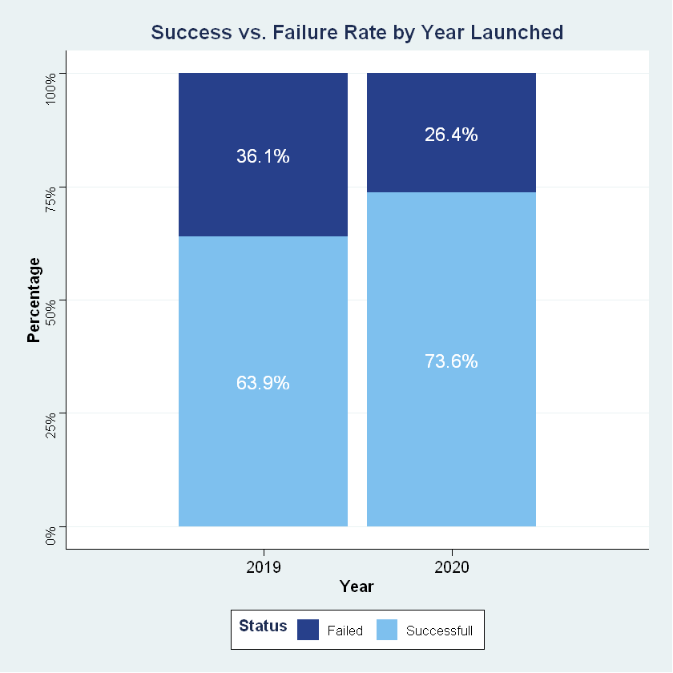 
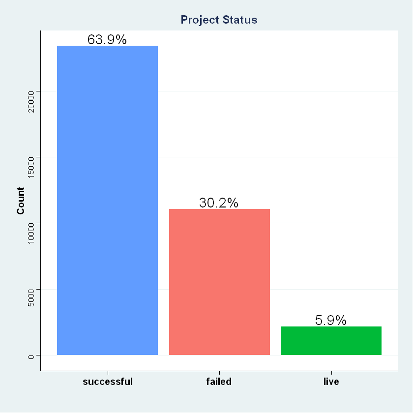

*Figure 1: Project Status Distribution*

The dataset contained data ranging from January of 2019 to July of 2020. And, from the first plot, we can see that the success rate in 2020 has increased by around 10% as compared to 2019, from 63.9% to 73.6%.

Overall, 63.9% of the projects were found to be successful, 30.2% failed and 5.9% which are still “live". Hence, more projects are successful than failed. "Cancelled" and "Suspended" projects are removed from our analysis here.

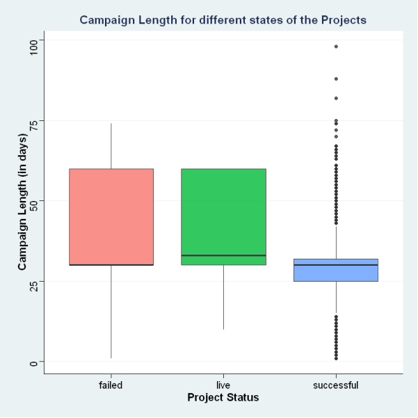 
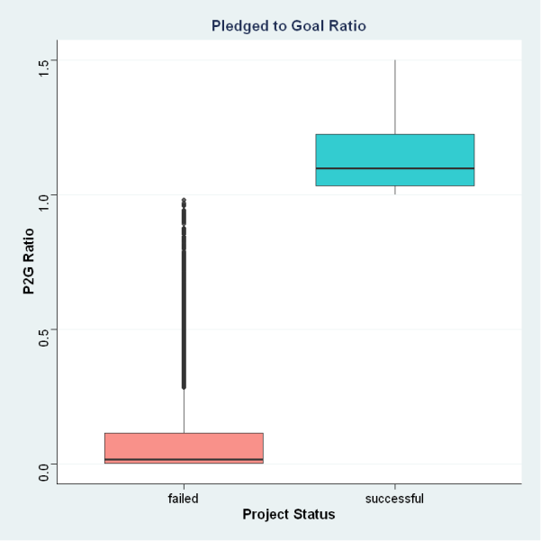

*Figure 2: Project status by Campaign Length and the ratio of Pledged to Goal Amount*

As seen from the first boxplot, successful projects have a lot of outliers, but the size of the box is small indicating a high concentration at around 30 days which makes it the ideal campaign length for successful projects. The upper quartile for failed and live projects is large, indicating that there is a right skewness in the distribution after 30 days.

From the second boxplot, we can see that, typically, failed projects won’t even reach 20% of their required goal but successful projects get 5% to 25% excess amount pledged over the set goal.

### What types of projects are most popular?

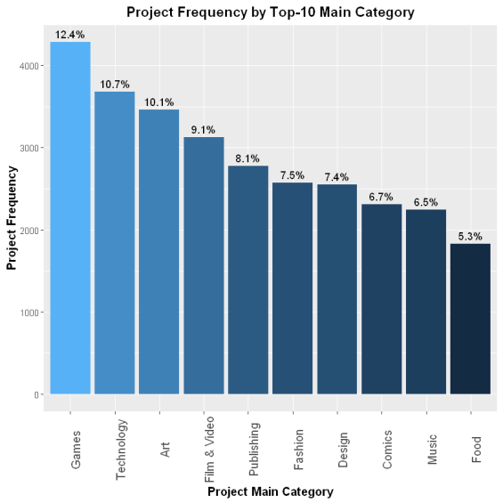 
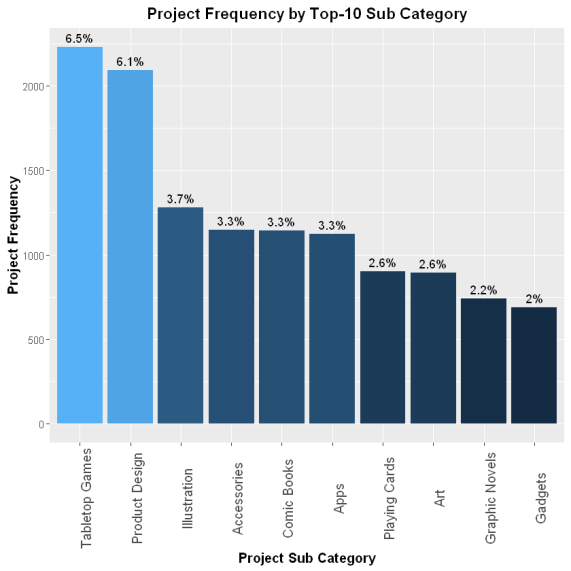

*Figure 3: Project Distribution by Main Categories and Subcategories*

After filtering out null values from our dataset, the most popular main categories by count are found to be Games, Technology and Art at 12.4%, 10.7% and 10.1% respectively. The most popular sub-categories are found to be Tabletop games (like board games, dice games, etc.) and Product  Design  (like  modular  shelves,  custom-designed  backpacks,  etc.)  at  6.5%  and  6.1% respectively.

### What types of projects are being funded?

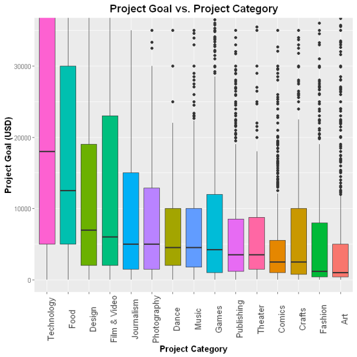 
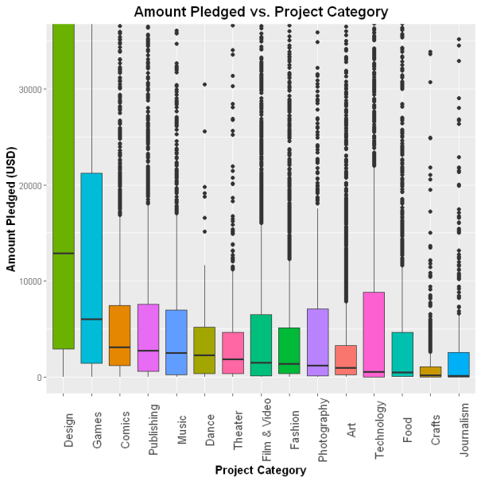

*Figure 4: Goal and Pledged Amount by Project Category*

The  above boxplots  show  the distribution  of  project  goals  and  the  amount  pledged  with  its respective category arranged in descending order of their medians.

When we see the Project goal in Technology, the median is very high at around $17,000 USD but when we see the same category in the Amount pledged plot, we can see that the pledged amount is really low. Even though there are many outliers, from the third plot we can see that the success rate of the Technology category is among the lowest i.e. 31.6%.

Similarly, when we see the design category, the pledged amount is very high since the goal is kept relatively low. And hence, the success rate is highest for the design category, at 89.1%.

From these plots, it can be hypothesized that a lower goal leads to a higher amount pledged and hence there is a high chance of the project being successful.

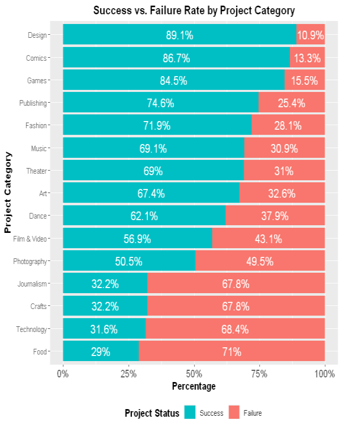 

*Figure 5: Success and Failure Rates by Category*

### Does campaign length impact the success rate of the project?

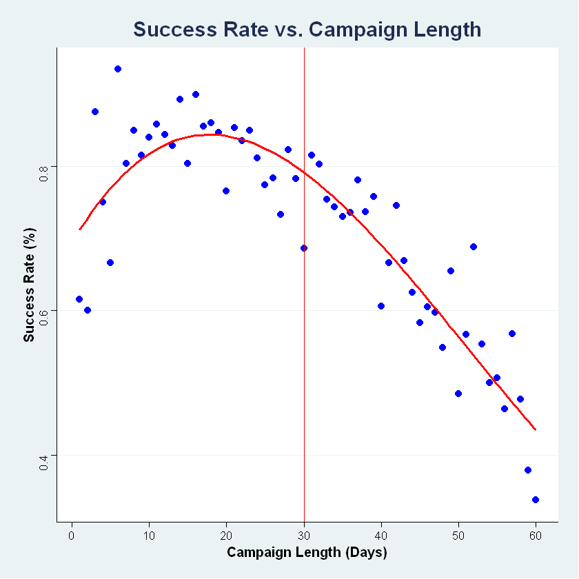 
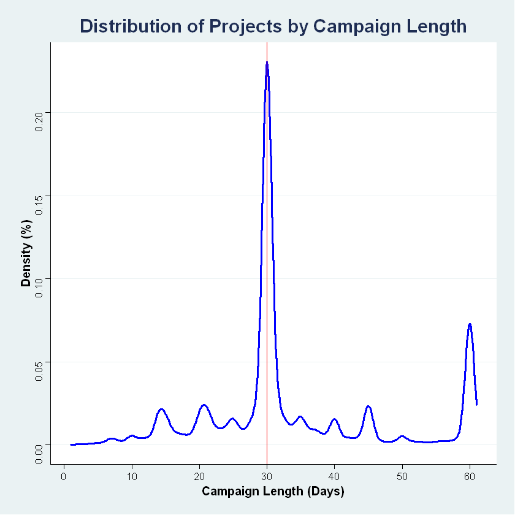

*Figure 6: Success Rate and Distribution of Campaign Length*

Kickstarter was founded in 2009 and until 2011, the maximum length of the project campaigns was 90 days. But since 2011, the max campaign length is capped at 60 days. Kickstarter has advised that **“Projects on Kickstarter can last anywhere from 1 - 60 days. We've done some research and found that projects lasting any longer are rarely successful. We recommend setting your campaign at 30 days or less” (Kickstarter, 2020).** This quote from the company is directly aligned with the data, and their advice has been noticed by campaigners.

In order to test this claim, campaign length vs success rate was plotted with a non-linear regression of 3rd order polynomial and found that the success rate during the initial few days is higher. After 30 days the probability of the project reaching its goal is significantly reduced.

From the second plot, we can see a peak at the 30th day which is the recommended length by Kickstarter. Our theory is that having more time does not create a sense of urgency. Instead, it makes it easier for backers to procrastinate, and sometimes they forget to come back at all. When a project launches the creator’s most avid fans rush to show their support and as time runs out, people who have been sitting on the sidelines are motivated to finally take action. Hence, choosing a shorter duration better positions a project for success.

### Impact of COVID-19 on Kickstarter Projects

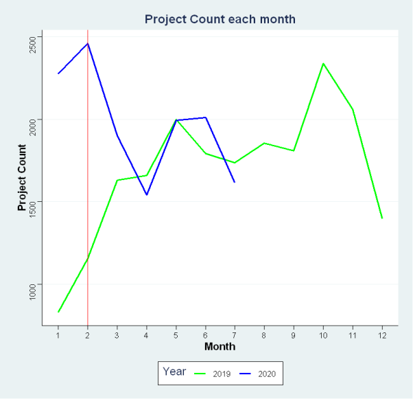 
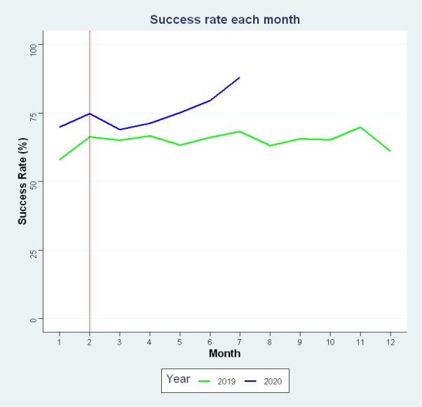

*Figure 7: Project Count and Success Rate by Month across 2019 and 2020.*

Since the US was highly affected by COVID and due to Kickstarter being highly used in the US as compared to other countries, US data was considered for this analysis. The blue line represents 2020, and the green one represents 2019. Considering the pandemic started in February of 2020, represented by the red x-intercept line, from the line plots we can see that 2020 started off really well in terms of project count and success rate.  As compared to last year’s statistics, 2020 is at par or even better than 2019 in terms of project count and success rate.

### Does launch weekday affect success?

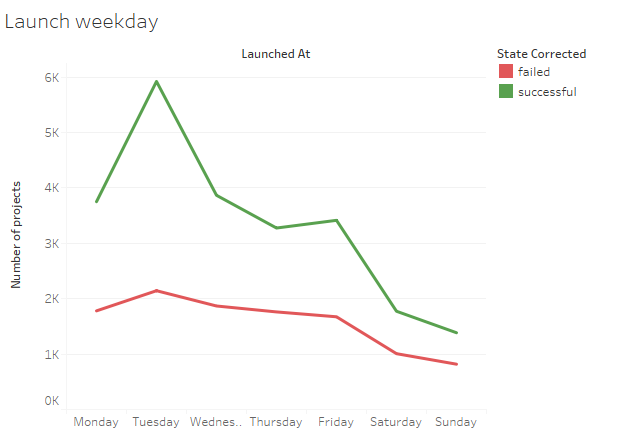

*Figure 7b: Project count by launch day*

During EDA, some less obvious features were examined, including various feature transformations and how they influence success. One such feature was the weekday on which the project was launched, which was determined by the given campaign launch date. As shown in the figure below, there seems to be a large number of projects launched on Tuesdays, and significantly fewer projects  launched on weekends. Furthermore, the ratio  between successes and failures seems to be the  largest on Tuesdays, indicating a higher chance of  campaign success when launched on Tuesdays.

## Conclusion

This project, "Kickstarter vs COVID," serves as a comprehensive guide for Kickstarter campaigners, offering valuable insights to optimize campaign strategies during and post-COVID-19. Through meticulous data analysis and visualization, several key findings emerged, providing actionable recommendations for enhanced campaign predictability and success.

The analysis revealed that campaign success is influenced by various factors, including the selection of project categories. Notably, Games, Technology, and Art emerged as the most popular main categories, with Tabletop games and Product design leading in subcategories. Understanding these preferences can help campaigners tailor their projects to align with popular trends.

Pledged amounts and success rates were closely examined, uncovering intriguing patterns. Projects with lower goals tend to attract higher amounts pledged, suggesting that setting realistic funding goals increases the likelihood of success. Additionally, campaign length plays a crucial role, with a recommended duration of 30 days or less significantly improving success rates. This finding aligns with Kickstarter's advice and emphasizes the importance of creating a sense of urgency.

The impact of COVID-19 on Kickstarter projects was assessed, indicating that despite the challenges posed by the pandemic, 2020 exhibited comparable or even better project counts and success rates than 2019. This insight provides a positive perspective for campaigners navigating uncertain times.

An often-overlooked factor, the day of the week a campaign is launched, was found to influence success. Projects launched on Tuesdays demonstrated a higher success ratio, suggesting that careful consideration of the launch day can contribute to overall campaign effectiveness.

In summary, this project contributes a wealth of insights to empower Kickstarter campaigners. By leveraging these findings, campaigners can make informed decisions about project categories, funding goals, campaign lengths, and launch days, ultimately enhancing their chances of success in the dynamic crowdfunding landscape.
